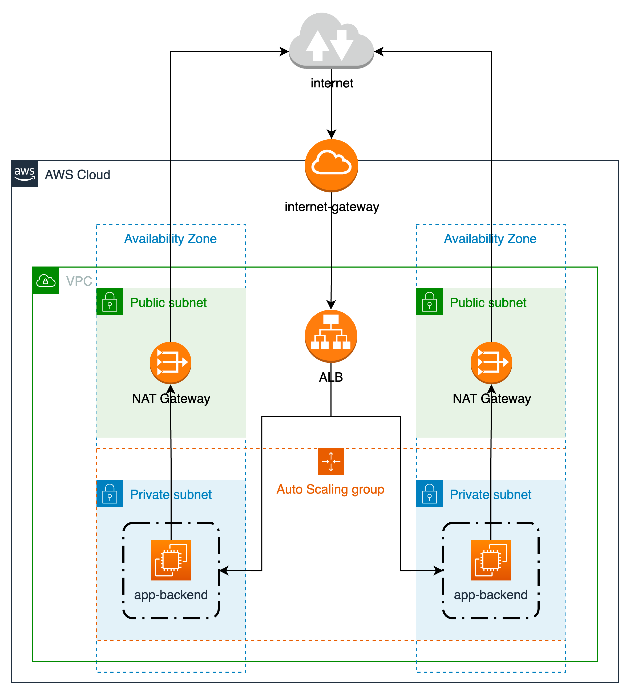

# player-backend

### 1️⃣ 프로젝트 소개

---

-

사용자 맞춤형 AI 친구와 함께하는 JAKA의 로봇 요리 배달/주문 서비스이다. 사용자는 앱을 사용하면서 가상의 AI 친구를 만나게 되고 이 친구에게 밥을 주고 대화를 하는 등의 데일리 활동과 음식을 주문하는 과정, 다양한 미션등에서 친밀도를 쌓을 수 있다.이 친밀도에 따라서 주문을 하는 과정에서 추가적인 옵션이 해금되거나 각 지점별로 호감도 랭킹을 보여주거나, 포인트로 결제를 하거나 악세서리를 사는 등, 여러 작업들이 가능할 것이다.
특히 LLM AI를 활용하여 자연스러운 AI를 구현하여 그 효과를 증대할 수 있다. (프로토타입과정에서는 시나리오로 대체될 수 도 있다.)

### 2️⃣ 목적 및 필요성

---

로봇 요리 보급의 가장 큰 장벽은 심리적 장벽이다. 처음 한두번은 신기해서 이용할지라도 반복적으로 사용하고 친밀함을 가지고 관계를 가지기 어렵다. 이에 로봇에 인격을 부여하여 사용자와의 관계를 가지고 지속적으로 관계를 맺는 AI 배달 서비스를 만들고자 한다. 특히 기존의 노동자의 경우 감정노동으로 인한 여러 문제가 제기되는 시점에서, 로봇에는 인권이 없다는 점을 이용하여, 사용자에게 맞는 1:1 AI 친구 서비스를 제공하여 친밀감과 유대감을 쌓을 수 있고 다양한 브랜드 경험을 느끼게 할 수 있을 것이다.

### 3️⃣ 주요 기능

---

필수 기능

1.  로그인/아웃 + 계정
2. 1:1 맞춤형 AI 친구 서비스(대화/이미지/쓰다듬기 등)
3. 호감도 시스템 / 적립금 시스템
4. 음식 추천
5. 호감도 랭킹
6. 해금 기능(라떼 아트 or 형태 변형)
7. 음식점/메뉴 검색

부가 기능

1. 미션
2. 코스튬
3. 맞춤형 음식 추천
4. 맞춤형 음식 제공
5. 콜라보
6. 결제

### 4️⃣ 개발 결과물

---

- 웹앱 ( 메뉴 추천 / 친밀도 / 랭킹 / 인공지능 / 해금)

### 5️⃣ 기대 효과 및 활용 방안

---

이 서비스를 통하여 요리하는 로봇에 대한 친밀한 이미지를 구축할 수 있으며, 자체 앱을 활용하기에 중간 수수료를 줄이고 고객 데이터를 확보할 수 있으며, 브랜드 이미지와 CRM이 원활하게 가능해지며 높은 MAU를 확보할 수 있다.

또한 각종 기능의 해금과 귀여운 캐릭터로 인하여 사용자들의 경험 공유욕을 증대시키고, 유튜브, 인스타등의 SNS로 자연스러운 홍보와 확장을 노릴 수 있다. 특히 다양한 IP들과의 협업/콜라보의 가능성도 열려있으며(,EX) 연예인이 만든 동작 그대로 만들기, 목소리, 아바타, 악세서리 등등), 시즌 아이템 등과 미션 등을 통하여 수집욕도 자극 할 수 있을 것이다.

그 외에도 사용자 맞춤형 요리를 제공할 수도 있을 것이다. 동일한 메뉴의 경우 사용자의 취향(맵기, 짜기, 달기 등등)에 맞추어서 어느 곳에서든 동일한 퀄리티의 맞춤형 음식을 제공 받을 수 있을 것이다.

이와 같이 다양한 실시예와 방대한 확장성을 가지고 있으며, 핵심 문제를 효과적으로 해결하여 요리하는 로봇에 대한 친밀한 이미지를 구축해 심리적 진입장벽을 크게 줄이고 하나의 문화 트렌드로 나아갈 수 있을 것이다.

### swagger 접속
```
https://junction.accongbox.com/docs/index.html
```

### AWS Architecture
